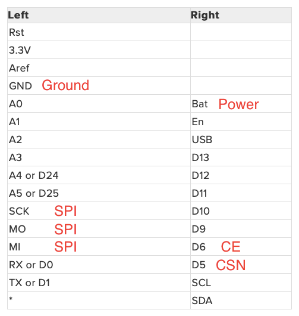

# nRF24-CircuitPython-Badge
CircuitPython badge running a simple program to test basic radio communications.

The full description and distance measurement analysis can be found on my blog post below.

[Tea and Tech Time: Measuring the Range of nRF24L01 Modules with CircuitPython](https://teaandtechtime.com/measuring-the-range-of-nrf24l01-modules-with-circuitpython/)

## Hardware Setup

The badges both use the Feather specification which means it was really easy to create two wings that connect to back of the badges. I used protoboard and pin headers to create a prototype that i could mount the voltage regulator board and radio.

The pin out for which I have labled below.

## Required Libraries

Already included in the lib folder for convinience

* Adafruit PyBadger
* CircuitPython nRF24L01
* Adafruit lis3dh
* Adafruit miniqr
* Adafruit bitmap font
* Adafruit display shapes
* Adafruit display text
* neopixel

## Instructions

Update your circuitpython capable badge using the U2F files for your particular badge. I have included the bootloaders and CircuitPython U2Fs for the Adafruit PyGamer badge and the Adafruit EdgeBadge. To update the bootloader you need to enter the current one first. This is accomplished by double tapping the reset button on your badge while plugged in via USB. You should see aspecial screen on your badge and a USB drive that is named BOOT attached to your computer. YOu can then drag the bootloader file onto the device, wait till it restarts, then repeat with the circuitpython u2f. A new drive should show up named CIRCUITPY.

Open the drive and copy over the files in the lib folder over to the lib folder on the badge. Once that is done you can copy over the code.py file onto the drive replacing the one that is currently there. Your badge should start printing to the screen some information as it reloads. If you have the radio hardware connected similar to my set up your are good to go. If you see an error saying that the hardware is unavailible or cannot connect you need to change the hardware or remap some of the pins in the code.py to suit your set up.

Also you will need to change the radio_number from 0 to 1 on your companion board for successful communication.

From here you can start the transmitter by pressing the A button, and conversely press the B button for the receiver mode. START will place the device in idle mode and pressing SELECT will print some radio status to the commandline although it is not readable without a computer serial connection to view it.